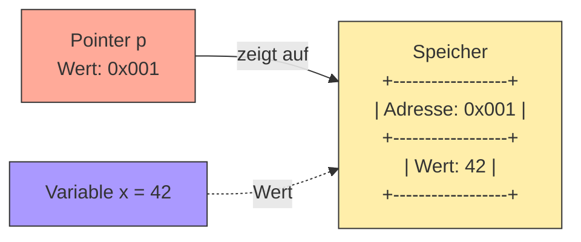

# Pointer in Go

Pointer sind Variablen, die eine Speicheradresse einer anderen Variable speichern. 



## Wichtige Konzepte:

1. `&x` (Adresse von): Gibt die Speicheradresse einer Variable zurück
2. `*x` (Wert von x, Dereferenzierung): Greift auf den Wert an einer Speicheradresse (einer Pointer Variablen) zu
3. Pointer-Typ wird mit `*T` deklariert, wobei T der Typ der referenzierten Variable ist

Hinweis: Go hat keine Pointer-Arithmetik wie in C oder C++. Das macht die Arbeit mit Pointern sicherer und einfacher.

## Häufige Anwendungsfälle:

1. Große Datenstrukturen effizient übergeben
2. Werte in Funktionen ändern (Pointer Receiver)
3. Gemeinsame Nutzung von Daten zwischen verschiedenen Teilen des Programms

```go
func main() {
    // Eine normale Variable
    x := 42
    
    // Einen Pointer erstellen mit &
    pointerZuX := &x
    
    // Wert an der Pointer-Adresse lesen mit *
    wertVonX := *pointerZuX
    
    fmt.Printf("x = %v\n", x)                  
    fmt.Printf("pointerZuX = %v\n", pointerZuX)
    fmt.Printf("wertVonX = %v\n", wertVonX)    
    
    // Wert über Pointer ändern
    *pointerZuX = 100
    fmt.Printf("x nach Änderung = %v\n", x)    // x = 100
}
```


## Praktisches Beispiel mit einer Funktion:

```go
// Funktion ohne Pointer (Wert wird kopiert)
func erhoeheOhnePointer(zahl int) {
    zahl += 1
}

// Funktion mit Pointer (arbeitet direkt mit der Original-Variable)
func erhoeheMitPointer(zahl *int) {
    *zahl += 1
}

func main() {
    nummer := 10
    
    erhoeheOhnePointer(nummer)
    fmt.Println(nummer)  // Ausgabe: 10 (unverändert)
    
    erhoeheMitPointer(&nummer)
    fmt.Println(nummer)  // Ausgabe: 11 (verändert)
}
```


## Beispiel mit einer Struktur (siehe auch [StructsAndMethods.md](../struct/StructsAndMethods.md)):

```go
type Person struct {
    Name string
    Alter int
}

func geburtstag(p *Person) {
    p.Alter++  // In Go kann man den Stern weglassen
    // (*p).Alter++ // Dies wäre die explizite Schreibweise
}

func main() {
    peter := Person{"Peter", 30}
    geburtstag(&peter)
    fmt.Printf("%s ist jetzt %d Jahre alt\n", peter.Name, peter.Alter)
    // Ausgabe: Peter ist jetzt 31 Jahre alt
}
```

