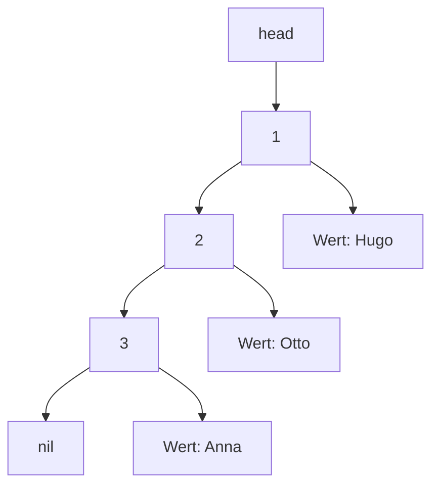

# Einfach verkettete Listen in Go

Verkettete Listen (Linked Lists) sind Datenstrukturen in der Informatik, die eine dynamische und flexible Möglichkeit bieten, Daten zu speichern und zu verwalten. Im Gegensatz zu Arrays, bei denen Elemente in einem zusammenhängenden Speicherbereich liegen, bestehen verkettete Listen aus einzelnen Knoten (Nodes), die durch Pointer miteinander verbunden sind.

Wie sieht das Diagramm aus, wenn 
 - ein Element in der Mitte gelöscht wird
 - ein Element in der Mitte eingefügt wird?
 - nur das 1. Element eingefügt/gelöscht werden kann?

 Bemerkung: Wenn nur das erste Element eingefügt/gelöscht werden kann, erhalten wir einen **Stack**.
