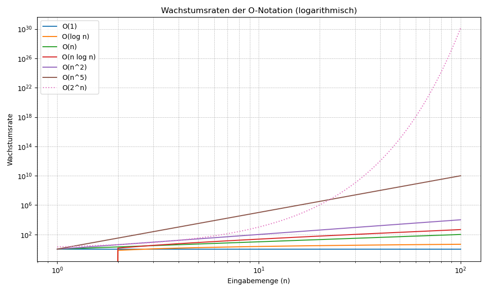

### Definition der O-Notation

Die O-Notation (auch "Big-O-Notation" oder Landau-Notation genannt)
beschreibt den Aufwand von Algorithmen bzw. die Komplexität von Funktionen in Abhängigkeit ihrer Eingabegröße. 

Mit Aufwand kann Laufzeit oder Speicherplatz gemeint sein. Wir verwenden die O-Notation in erster Linie für die Laufzeit.

### formale Definition:

f(n) ∈ O(g(n)), wenn c, m∈Ν existieren, sodass f(n) ≤ c ∗ g(n) für alle n≥m.

### Wichtige Komplexitätsklassen

| Notation          | Beschreibung                                                                                           |
|--------------------|-------------------------------------------------------------------------------------------------------|
| \( O(1) \)         | **Konstant**: Laufzeit unabhängig von der Eingabemenge.                                               |
| \( O(\log n) \)    | **Logarithmisch**: Effizient bei großen Eingaben, z.B. binäre Suche.                                   |
| \( O(n) \)         | **Linear**: Laufzeit wächst proportional zur Eingabemenge.                                            |
| \( O(n \log n) \)  | **Quasilinear**: Typische Komplexität effizienter Sortieralgorithmen wie Mergesort.                 |
| \( O(n^2) \)       | **Quadratisch**: Häufig bei verschachtelten Schleifen, z.B. einfache Sortieralgorithmen wie Bubblesort.|
| \( O(n^k) \)       | **Polynomial**: .|
| \( O(2^n) \)       | **Exponential**: Sehr ineffizient für große \(n\), z.B. beim Durchsuchen aller Kombinationen.         |




### Hinweis
wie ermittelt man die Komplexitätsklassen? 
 - überlege, was die Eingabegröße ist - bei Zahlen ist dies meist die Zahl selbst; bei Strings die Länge des Strings
 - zähle die Anweisungen 

 ```go
for i := 0; i < n; i++ {
	for j := 0; j < n; j++ {
        x += 1
        y += 1
        z += 1
    }
}
 ```
In obigem Beispiel werden 3 * n^2 Additionen ausgeführt, also die die Komplexität O(n^2).

### 
Oft hängt die Komplexität von den Eingabedaten ab. Z.B. muss BubbleSort nur einmal durch den Array loopen, wenn dieser schon sortiert ist. Wenn der Array umgekehrt sortiert ist, macht Bubblesort die maximale Anzahl an vertauschungen. In der Praxis macht man deshalb häufig die Unterscheidung
 - **best case**
 - **average case**
 - **worst case**