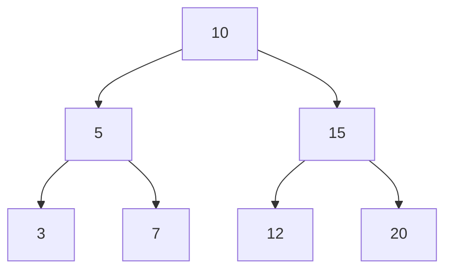
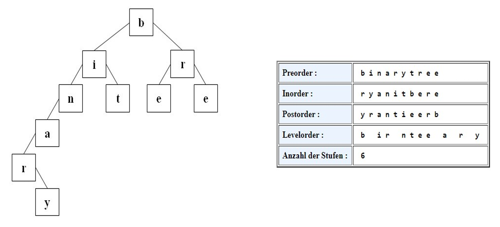

# Binärbaum

Ein Binärbaum ist
 1. Leer oder
 2. Besteht aus einem Knoten – Wurzel genannt – und zwei Binärbäumen, dem linken und dem rechten Teilbaum

Beispiel: Binärbaum mit int Werten:

```go
type Node struct {
	data  int
	left  *Node
	right *Node
}
``` 

# Binäre Suchbäume
Ein binärer Suchbaum ist ein Binärbaum, für den zusätzlich gilt: Der Inhalt des Wurzelknotens ist größer gleich allen Elementen im linken Suchbaum und echt kleiner als alle Elemente im rechten Suchbaum. (für den Datentyp muss eine "kleiner"-Relation definiert sein)

Je nachdem, in welcher Reihenfolge die Elemente in den Baum geschrieben werden, ändert sich der Aufbau des Baums, z.B:
```
		X				Z
       / \ 			   /
      U   Z			  X
					 /
					U
```

## Binäre Bäume - Traversierungen
### Preorder
 * Besuche die Wurzel
 * Traversiere den linken  Teilbaum Preorder
 * Traversiere den rechten Teilbaum Preorder
### Inorder
 * Traversiere den linken Teilbaum Inorder
 * Besuche die Wurzel
 * Traversiere den rechtenTeilbaum Inorder
### Postorder
 * Traversiere den linken Teilbaum Postorder
 * Traversiere den rechtenTeilbaum Postorder
 * Besuche die Wurzel
### Levelorder
 * Besuche die Knoten schichtenweise: 
 * Zuerst die Wurzel
 * Dann die Söhne
 * Dann die nächste Etage, etc ...



Binäre Suchbäume besitzen die **Sortierungseigenschaft**: Die Daten in einem binären Suchbaum sind in Inorder Reihenfolge korrekt sortiert.


